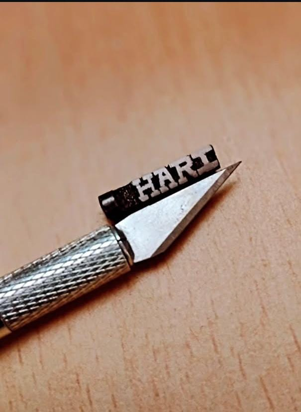
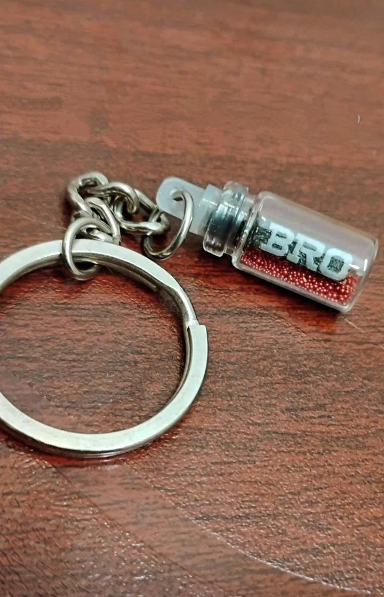

<!DOCTYPE html>
<html lang="en">
<head>
  <meta charset="UTF-8" />
  <meta name="viewport" content="width=device-width, initial-scale=1.0"/>
  <title>Mycro Arts | Micro Art</title>
  
</head>
<body>

  <header>
    
    Mycro Arts – Tiny Masterpieces
  </header>

  

    <h2>🎨 Our Work</h2>
    

      

        
        
        
        
        
        
      

      

        
        
        
        
        
        
      

    

    <h2>🛒 Place Your Order</h2>
    <form>
      <input type="text" name="name" placeholder="Your Name" required />
      <input type="tel" name="phone" placeholder="Phone Number" required />
      <input type="text" name="location" placeholder="Location" required />
      <input type="text" name="pincode" placeholder="Pincode" required />

      <label for="product">Type of Product:</label>
      <select name="product" id="product" required>
        <option value="">-- Select --</option>
        <option value="chalk">Chalk Art (Custom Name)</option>
        <option value="pencil">Pencil Lid Art (Custom Name)</option>
      </select>

      <textarea placeholder="Any special request?" rows="3"></textarea>

      <button type="submit">Submit Request</button>
    </form>

    

      📍 <strong>Order Method:</strong> 
      1. Direct message us on Instagram: <a href="https://instagram.com/mycro_arts" target="_blank">@mycro_arts</a> 
      2. Web page order available only for <strong>Nagapattinam-611 101</strong> surroundings (District of Tamil Nadu)  
      📧 Email: <a href="mailto:miiicroartz@gmail.com">miiicroartz@gmail.com</a>
    

  

  <footer>
    © 2025 Mycro Arts | Designed with ❤️ by 
    <a href="https://instagram.com/perf.cut" target="_blank">Perfcut</a>
  </footer>

</body>
</html>
